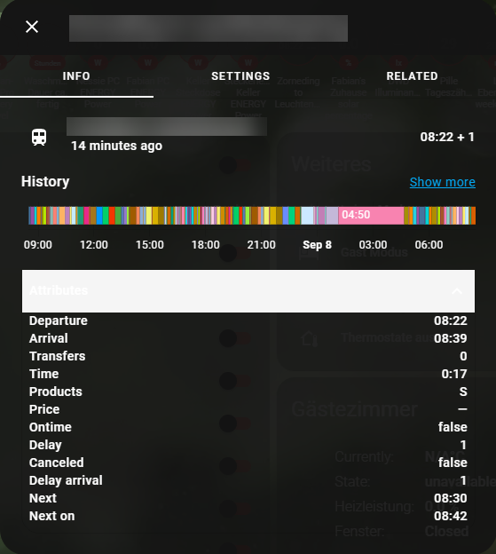

[](https://github.com/hacs/integration)
# Deutsche Bahn Homeassistant Sensor
The `deutschebahn` sensor will give you the departure time of the next train for the given connection. In case of a delay, the delay is also shown. Additional details are used to inform about, e.g., the type of the train, price, and if it is on time.





The official Deutsche Bahn Homeassistant integration got removed with release 2022.11 - therefore this custom integration exists. It got removed due to cloud scraping, but still was fully functional.

Please note that I will only give limited support on this integration

This integration is based on the formerly officia HA DB integration, see [here](https://github.com/home-assistant/core/tree/c741d9d0452970c39397deca1c65766c8cb917da/homeassistant/components/deutsche_bahn).

This sensor stores a lot of attributes which can be accessed by other sensors, e.g., a [template sensor](https://www.home-assistant.io/integrations/template/).

Old Homeassistant documentation can be found [here](https://github.com/home-assistant/home-assistant.io/blob/b38ab5e8bc745e8e751eb27c2c079de8a8e83d5e/source/_integrations/deutsche_bahn.markdown).

## Installation
### 1. Using HACS (recommended way)

This integration is a official HACS Integration.

Open HACS then install the "Deutsche Bahn" integration or use the link below.

[](https://my.home-assistant.io/redirect/hacs_repository/?owner=FaserF&repository=ha-deutschebahn&category=integration)

If you use this method, your component will always update to the latest version.

### 2. Manual

- Download the latest zip release from [here](https://github.com/FaserF/ha-deutschebahn/releases/latest)
- Extract the zip file
- Copy the folder "deutschebahn" from within custom_components with all of its components to `<config>/custom_components/`

where `<config>` is your Home Assistant configuration directory.

>__NOTE__: Do not download the file by using the link above directly, the status in the "master" branch can be in development and therefore is maybe not working.

### Migrate from the old official HA integration or from this V1.X to 2.X Version
1. Remove any deutschebahn (or deutsche_bahn) configuration from your configuration.yaml file
2. Update the Integration to the latest release
3. Restart Homeassistant
4. Set up the integration from the UI

## Configuration

Go to Configuration -> Integrations and click on "add integration". Then search for "Deutsche Bahn".

[](https://my.home-assistant.io/redirect/config_flow_start/?domain=deutschebahn)

### Configuration Variables
- **from**: The name of the start station.
- **to**: The name of the end/destination station.
- **offset** (optional): Do not display departures leaving sooner than this number of seconds. Useful if you are a couple of minutes away from the stop. The formats "HH:MM" and "HH:MM:SS" are also supported.
- **only direct** (optional - default is false): Only show direct connections.
- **products to ignore** (optional - default is empty): Filter train types, that should be excluded

### YAML Config
DEPRECATED, use the GUI setup instead! Only valid for Version 1.X

```yaml
# Example configuration.yaml entry
sensor:
  - platform: deutschebahn
    from: NAME_OF_START_STATION
    to: NAME_OF_FINAL_STATION
```

```yaml
# Example advanced configuration.yaml entry
sensor:
  - platform: deutschebahn
    from: NAME_OF_START_STATION
    to: NAME_OF_FINAL_STATION
    offset: 00:03:30
    only_direct: false
```

## Lovelace Custom Card
[silviokennecke](https://github.com/silviokennecke/) has created [this](https://github.com/silviokennecke/ha-custom-components/wiki/Components#public-transport-connection) great lovelace card for a better overview of the train departures. Be sure to check it out.

## Bug reporting
Open an issue over at [github issues](https://github.com/FaserF/ha-deutschebahn/issues). Please prefer sending over a log with debugging enabled.

To enable debugging enter the following in your configuration.yaml

```yaml
logger:
    logs:
        custom_components.deutschebahn: debug
```

You can then find the log in the HA settings -> System -> Logs -> Enter "deutschebahn" in the search bar -> "Load full logs"

## Thanks to
Huge thanks to [@homeassistant](https://github.com/home-assistant/core/tree/c741d9d0452970c39397deca1c65766c8cb917da/homeassistant/components/deutsche_bahn) for the official old integration, where this one is based on!
Also to [@kennell](https://github.com/kennell/schiene) for the schiene python library that this integration is using.

The data is coming from the [bahn.de](https://www.bahn.de/p/view/index.shtml) website.
